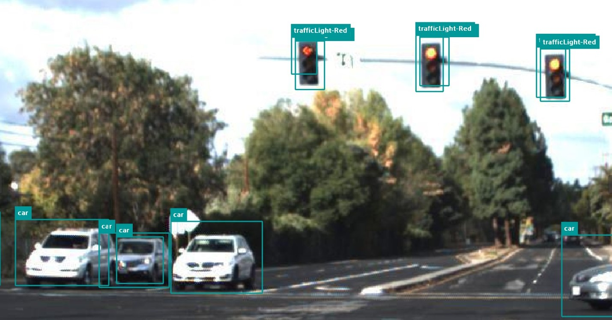
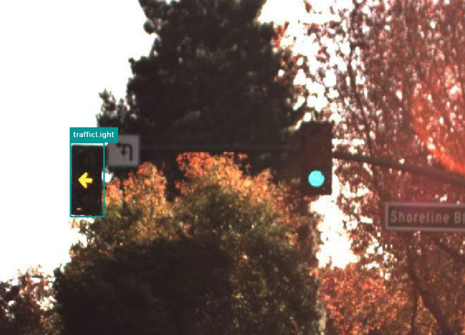

# Observaciones del dataset

## Tag duplicados en imágenes:

Aparecen tags duplicados en una misma imagen

id: 6643a0d055913803043b126a

## Reflejos:

id: 6643a0d255913803043b1d55

## Pocos tags de `trafficLight-YellowLeft`

## Comportamiento extraño con el tag `trafficLight`

El tag `trafficLight` se usa para representar semáforos de todos los colores.

id: 6643a0ce55913803043b041f

id: 6643a0cf55913803043b060a

